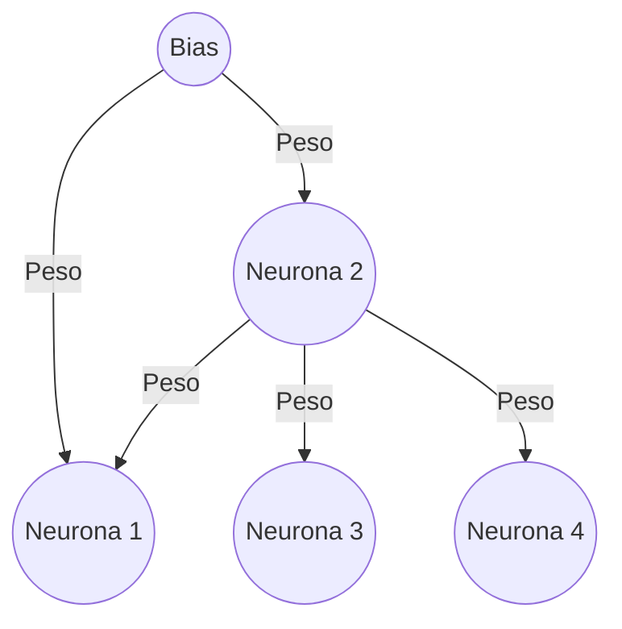

# Exponentes negativos
Cheatsheet de exponentes negativos.

Reglas:

* Inverso de un número elevado a un exponente negativo:
``` tex
a^{-n} = 1/a^n
```
Esto significa que si tienes un número elevado a un exponente negativo, puedes encontrar su inverso tomando el número a la inversa y cambiando el signo del exponente.

* Multiplicación de términos con la misma base:
```tex
a^n * a^{-m} = a^{n-m}
```
  Cuando multiplicas dos términos con la misma base y exponentes de signos opuestos, puedes restar los exponentes.

* División de términos con la misma base:
```tex
a^n / a^{-m} = a^{n+m}

```
  Cuando divides dos términos con la misma base y exponentes de signos opuestos, puedes sumar los exponentes.

